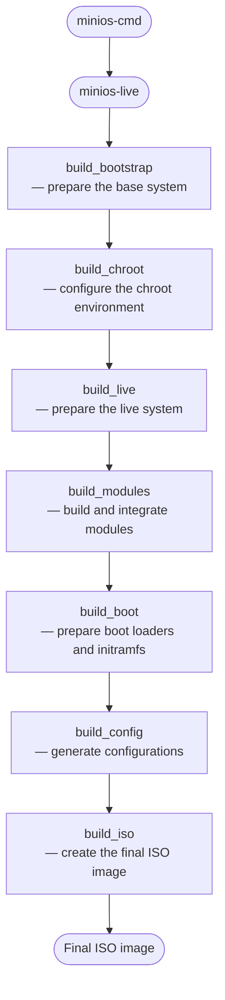

# 


MiniOS is a reliable and user-friendly portable system with a graphical interface. These scripts build a bootable MiniOS ISO image.

## 🌐 Resources

Learn more about using and building MiniOS:

### 🖥️ Official Website

The [official website](https://minios.dev) is your central hub for information about MiniOS.  Find details on the different editions available, their respective features, community forums for support, and direct download links for the ISO images.

### 📚 Official Wiki

The [official Wiki](https://github.com/minios-linux/minios-live/wiki) provides in-depth knowledge and practical guidance for working with MiniOS. Explore comprehensive guides covering installation procedures, system configuration, customization options, and how to extend functionality with modules.

### 🛠️ Building MiniOS

MiniOS provides two powerful tools for building customized ISO images:

- **`minios-cmd`:**  This command-line utility simplifies the configuration and initiation of builds.  It provides a user-friendly interface for setting various build parameters like the target distribution, architecture, desktop environment, kernel options, locale, and more.  `minios-cmd` then uses these parameters to generate a configuration file for `minios-live` and automatically triggers the build process.  [Learn more about building with `minios-cmd`](docs/minios-cmd.md).

- **`minios-live`:** This script orchestrates the step-by-step build process. It handles tasks such as setting up the build environment, installing the base system, integrating the chosen desktop environment, creating the SquashFS filesystem, configuring the boot process, and finally generating the bootable ISO image.  [Learn more about building with `minios-live`](docs/minios-live.md).

### Project Directory Structure

````plaintext
minios-live/
├── linux-live/                 # Core scripts and build libraries
│   ├── bootfiles/              # Files and templates for booting (GRUB, ISOLINUX, EFI, etc.)
│   ├── environments/           # Environment descriptions and settings
│   ├── initramfs/              # Scripts for creating initramfs
│   ├── scripts/                # Module scripts and templates
│   ├── build-initramfs         # Script for separate initramfs build
│   ├── build.conf              # Main build configuration file
│   ├── condinaut               # Script/tool for working with package lists
│   ├── install-chroot          # Script for installing into the chroot environment
│   ├── minioslib               # Core Bash function library
│   └── prerequisites.list      # List of required packages for installation on the host for building
├── tools/                      # Auxiliary build scripts
├── minios-cmd                  # CLI utility for setting build parameters
└── minios-live                 # Main script for building MiniOS
````

### MiniOS Build Process



**Note:**

* For information on modifying existing modules and adding your own modules, read [Module Building](linux-live/scripts/10-example/README.md).

## ✍️ Author

Created by [crims0n](https://github.com/crim50n).  Learn more at [minios.dev](https://minios.dev).