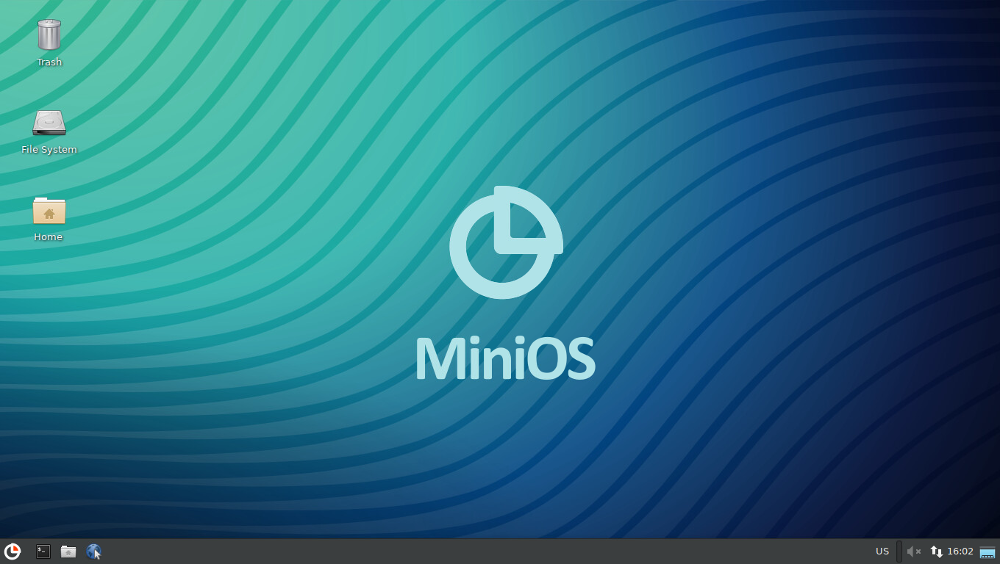

[](https://minios.dev)

The goal of MiniOS is to provide users with a reliable user-friendly portable system with a graphical interface.

These scripts build a bootable MiniOS ISO image.

Using minios-live, you can build:

*Debian 9, 10, 11, 12 with Fluxbox environment (analogous to [Slax](https://www.slax.org/)).*

*Debian 9, 10, 11, 12, Testing, Unstable, Kali Linux and Ubuntu 20.04, 22.04 with Xfce4 environment.*

To build, you need to change the parameters in the **linux-live/buildconfig** file to build the required option, then start the build: `./install -`

It is advisable to use Debian 12 or Ubuntu 22.04 for build, since in this system you can build MiniOS based on Debian 9,10,11,12 and Unbuntu 20.04, 22.04. If you have a different system installed, use docker.

For installation use **install** \- script for guided installation\, **autoinstall** \- script for automatic installation\.

**Never run scripts from linux-live folder! They will break your system.**

**Supported commands:** `setup_host build_bootstrap build_chroot build_live build_modules build_iso`

*setup\_host* \- installing packages required for building on the host

*build\_bootstrap* \- install a minimal system using debootstrap

*build\_chroot* \- installation of the rest of the components required to start the system

*build\_live* \- build squashfs image

*build\_modules\_chroot* \- building modules

*build\_iso* \- build the final ISO image

**Syntax:** `./install [start_cmd] [-] [end_cmd]`

* launch from start\_cmd to end\_cmd
* if start\_cmd is omitted, all commands are executed starting from the first
* if end\_cmd is omitted, all commands up to the last are executed
* enter one command to run a specific command
* enter '-' as the only argument to run all commands

```
  Examples: ./install -
            ./install build_bootstrap - build_chroot
            ./install - build_chroot
            ./install build_bootstrap -
            ./install build_iso
```

If you want to just build the system from the beginning just edit `linux-live/buildconfig` and run `./install -`

To build with docker, create a build folder in your home folder, put `minios-live` there, `cd` to `docker` folder and run `01-runme.sh`. This action will install the required programs and create an image. To start the build, edit for yourself and run `02-build.sh`. Sample file content:
`docker run --rm -it --name mlc --privileged -v /home/user/build:/build local/mlc install -`
or you can use the `minios-live/batch-build` script by editing the necessary parameters for yourself instead of `02-runme.sh`.

Author: crims0n [https://minios.dev](https://minios.dev)
